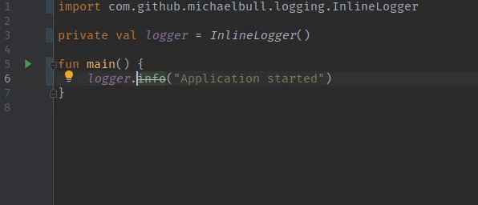

# kotlin-inline-logger

[](https://search.maven.org/search?q=g:com.michael-bull.kotlin-inline-logger) [](https://github.com/michaelbull/kotlin-inline-logger/actions?query=workflow%3Aci) [](https://github.com/michaelbull/kotlin-inline-logger/blob/master/LICENSE)

A logger facilitating lazily-evaluated log calls via Kotlin's inline [classes][inline-classes] & [functions][inline-functions].

## Installation

```groovy
repositories {
    mavenCentral()
}

dependencies {
    implementation("com.michael-bull.kotlin-inline-logger:kotlin-inline-logger:1.0.2")
}
```

## Introduction

`kotlin-inline-logger` has been structured as a [`multiplatform project`][mpp].
Currently the only implementation supports the JVM, utilising [SLF4J][slf4j],
however in future other platforms can also be supported by implementing the
necessary platform-specific APIs found in [`src/commonMain`](src/commonMain).

If you would like to implement support for a platform, please don't hesitate
to open a pull request on [GitHub][github].

### JVM

On the JVM, `kotlin-inline-logger` provides inline functions that delegate
to [SLF4J][slf4j]. Users migrating from an existing SLF4J solution will find
existing calls to logging functions like `logger.info("Example")` now marked as
`@Deprecated`, prompting them to replace their existing code with the
lazily-evaluated alternatives.



#### Creating loggers

By default, passing no argument when creating an `InlineLogger()` will utilise
`MethodHandles.lookup()`, introduced in JDK7, to derive the name of the logger
from the class that created it. This is described in SLF4J's documentation as
an [idiomatic method of declaring a logger][slf4j-idiom] that is resistant to
cut-and-paste errors:

```kotlin
class TransactionExecutor {
    val transactionLogger = InlineLogger() // named com.package.TransactionExecutor
}
```

Named loggers can be created by passing a `String`:

```kotlin
val transactionLogger = InlineLogger("DatabaseTransactions")
```

Class loggers can be created by passing a `::class` reference:

```kotlin
class TransactionExecutor

val transactionLogger = InlineLogger(TransactionExecutor::class)
```


#### Effectiveness

The code examples below illustrate how the Kotlin you write is compiled to
interoperable Java, demonstrating how the `expensiveCalculation()` function is
only invoked and interpolated with the log message if warn-level logging is
enabled.

This allows you to replace usages of SLF4J's [MessageFormatter][slf4j-formatter],
with the more idiomatic [string templates][string-templates] Kotlin provides.

##### Kotlin:

```kotlin
import com.github.michaelbull.logging.InlineLogger

val logger = InlineLogger("CalculationLogger")

fun expensiveCalculation(): Int {
    return 1234 * 5678
}

fun main() {
    logger.warn { "The result is: ${expensiveCalculation()}" }
}
```

##### Decompiled Java:

```java
import com.github.michaelbull.logging.InlineLogger;
import org.jetbrains.annotations.NotNull;
import org.slf4j.Logger;
import org.slf4j.LoggerFactory;

public final class ExampleKt {
    @NotNull
    private static final Logger logger;

    @NotNull
    public static Logger getLogger() {
        return logger;
    }

    public static int expensiveCalculation() {
        return 1234 * 5678;
    }

    public static void main() {
        Logger $this$iv = logger;
        if (InlineLogger.isWarnEnabled-impl((Logger) $this$iv)) {
            String string = "The result is: " + ExampleKt.expensiveCalculation();
            $this$iv.warn(String.valueOf(string));
        }
    }

    public static /* synthetic */ void main(String[] arrstring) {
        ExampleKt.main();
    }

    static {
        Logger delegate$iv = LoggerFactory.getLogger("CalculationLogger");
        logger = InlineLogger.constructor-impl((Logger) delegate$iv);
    }
}
```

## Contributing

Bug reports and pull requests are welcome on [GitHub][github].

## License

This project is available under the terms of the ISC license. See the
[`LICENSE`](LICENSE) file for the copyright information and licensing terms.

[inline-classes]: https://kotlinlang.org/docs/reference/inline-classes.html
[inline-functions]: https://kotlinlang.org/docs/reference/inline-functions.html
[mpp]: https://kotlinlang.org/docs/reference/multiplatform.html
[string-templates]: https://kotlinlang.org/docs/reference/basic-types.html#string-templates
[github]: https://github.com/michaelbull/kotlin-inline-logger
[slf4j]: https://www.slf4j.org/
[slf4j-idiom]: https://www.slf4j.org/faq.html#declaration_pattern
[slf4j-formatter]: https://www.slf4j.org/api/org/slf4j/helpers/MessageFormatter.html
